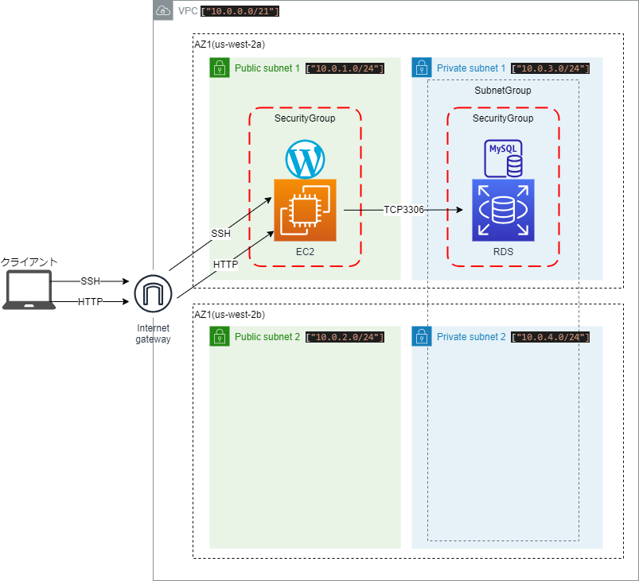

# Terraform勉強-第21回

githubリポジトリ："https://github.com/shu130/terraform-study21"

## テーマ：VPC, SecurityGroup, EC2, RDSの作成とWordPressセットアップ

- **Terraform公式モジュールやカスタムモジュールを使わずコード作成**
- **VPC、セキュリティグループ、EC2、RDS（MySQL）の作成**
- **EC2インスタンスで`user_data` を用い初回起動時にWordpress自動セットアップ**

## 構成：

- **VPC** : 2つのAZにパブリックとプライベート2つずつサブネットを作成
- **EC2** : `t2.micro`、Amazon Linux 2 AMIを使用  
  >> `user_data` でWordPressのセットアップを自動化
- **RDS** :  MySQLデータベースを作成し、WordPressで利用
- **セキュリティグループ** :  
  >> EC2: SSH（22）、HTTP（80）を開放  
  >> RDS: MySQL（3306）を開放

- **構成図**


---

## Notes

### 1. **`for_each`関数**

 - `for_each` は、複数のリソースを一度に作成したいときに使う  
 - **リストやマップ**を使って、同じタイプのリソースを異なる設定で作成

#### 例：セキュリティグループを複数作成

```hcl
resource "aws_security_group" "sg" {
  for_each = {
    ssh  = 22
    http = 80
  }

  name        = "allow-${each.key}"
  description = "Allow ${each.key} traffic"
  vpc_id      = aws_vpc.main.id

  ingress {
    from_port   = each.value
    to_port     = each.value
    protocol    = "tcp"
    cidr_blocks = ["0.0.0.0/0"]
  }
}
```

#### `each.key` と `each.value`

  - **`each.key`**: `for_each` で定義したマップのキー（`ssh`, `http` ）を参照
  - **`each.value`**: マップの値（`22`, `80` ）を参照

この例では、2つのセキュリティグループが作成される。  
  -  `allow-ssh`  ：SSH（ポート22）を許可
  -  `allow-http` ：HTTP（ポート80）を許可

#### `for_each` と `count` の違い

  - **`for_each`** は、リストやマップを基に複数のリソースを作成し、それぞれのリソースに個別のキーを持つ
  - **`count`** は整数を指定し、同じリソースを指定回数分だけ複製するが個別のキーを持つことは不可

### 2. **`length` 関数**

  - `length` の戻り値は整数で、リストやマップの要素数、または文字列の長さ。

#### 例: リストの長さを取得

```hcl
variable "subnets" {
  type    = list(string)
  default = ["subnet-12345678", "subnet-87654321", "subnet-11223344"]
}

output "subnet_count" {
  value = length(var.subnets)
}
```

この例では、`var.subnets` の要素数を取得、`output "subnet_count"` は `3` を返す。

#### 例: マップの要素数を取得

```hcl
variable "instance_ports" {
  type = map(number)
  default = {
    ssh  = 22
    http = 80
    https = 443
  }
}

output "port_count" {
  value = length(var.instance_ports)
}
```

この例では、`var.instance_ports` に定義されたマップの要素数（キーの数）を数え、`output "port_count"` は `3` を返す。

---  

### 3. **`templatefile` 関数**

 - `templatefile` 関数は、外部ファイルを読み込み、その中でTerraformの変数を動的に展開できるテンプレート処理を行う 
 - シェルスクリプトや設定ファイルなど、テンプレートとして変数を使いたい場合に利用。  

  ```hcl
  templatefile(path, vars)
  ```

  - **`path`**: テンプレートファイルのパス
  - **`vars`**: テンプレート内で展開するための変数を定義するマップ（`key = value`）

#### 使い方の例：
シェルスクリプト内にTerraformの変数を展開。

```hcl:./ec2.tf
resource "aws_instance" "example" {
  ami           = "ami-12345678"
  instance_type = "t2.micro"

  # user_data に templatefile を使って変数を展開
  user_data = templatefile("${path.module}/scripts/user_data.sh", {
    rds_db_name   = var.rds_db_name,
    rds_username  = var.rds_username,
    rds_password  = var.rds_password,
    rds_endpoint  = aws_db_instance.rds_instance.endpoint
  })
}
```

#### `user_data.sh` の例：

```bash:./scripts/user_data.sh
#!/bin/bash
yum -y update
# WordPressの設定
sed -i "s/database_name_here/${rds_db_name}/" wp-config.php
sed -i "s/username_here/${rds_username}/" wp-config.php
sed -i "s/password_here/${rds_password}/" wp-config.php
sed -i "s/localhost/${rds_endpoint}/" wp-config.php
```

  - `templatefile` 関数により（`user_data.sh`）内の変数がTerraformの値で展開され、動的に生成される
  - `${rds_db_name}` などのプレースホルダーが、変数に置換される

---

### 関連：**`templatefile` と `file` の違い**

| 関数名         | 用途                                                                 | 変数展開 | 使用例 |
|----------------|----------------------------------------------------------------------|----------|--------|
| `templatefile` | 外部テンプレートファイルを読み込み、変数を展開して動的に生成する     | できる   | スクリプトや設定ファイルのテンプレート |
| `file`         | 外部ファイルの内容をそのまま読み込む                                 | できない | 単純なスクリプトやファイル内容をそのまま使う |

---
今回は以上にしたいと思います。
